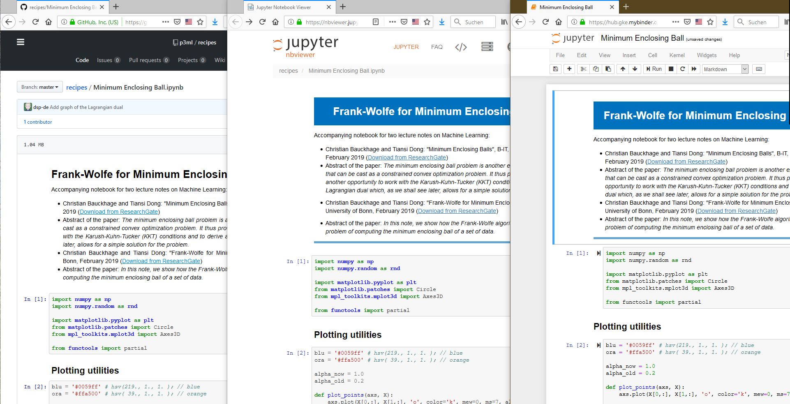

# Impulses for the Panel: The Open Science Publishing Flood and Collaborative Authoring

  - [Description of the
    Panel](https://github.com/mrchristian/Open-Science-Publishing-Flood-and-Collaborative-Authoring)

## Grey Literature as Result of the P3ML Project (Some Contribution to the Flood and Means to Navigate it)

The project P3ML funded by the Ministry of Education and Research of
Germany (BMBF) under grant number 01/S17064 offered student labs with a
strong focus on the practical aspects of Machine Learning. Furthermore,
it produced a variety of teaching materials. These were published on
different platforms:

  - [Own
    website](http://www.b-it-center.de/b-it-programmes/teaching-material/p3ml/)
  - [YouTube](https://www.youtube.com/user/bitLectures/videos)
  - [ResearchGate](https://www.researchgate.net/project/P3ML-ML-Engineering-Knowledge)
  - [GitHub](https://github.com/p3ml/)

## Jupyter Notebooks

All our notebooks have been published at
[GitHub](https://github.com/p3ml/). For ease of access we created an
explicit entry page at <https://p3ml.github.io>. While GitHub is great
for storing, sharing and versioning the notebook file, it does not
display all its content correctly. To see all elements as they are
meant, you may use [nbviewer](https://nbviewer.jupyter.org/). There are
even free services like [Binder](https://mybinder.org/) that allow to
work interactively with notebooks stored at GitHub.

| Screenshots of the "Minimum Enclosing Ball" notebook as displayed by GitHub, nbviewer and Binder |
|-----------------|
|                                       |

A notebook consists for cells that may contain formatted text (Markdown,
HTML, LaTeX), code (most often Python, might include data) and results
from previous runs including visualizations. When the user executes a
code cell, the code is send to a process in the background ("the
kernel"), executed and the result integrated into the notebook right
below the code cell.

## Elements of Explanation in Jupyter Notebooks

  - You may collocate your formulas in mathematical notation with the
    executable implementation. Examples:
      - [Multivariate Gaussian Distribution, Gaussian Mixture
        Distribution](https://nbviewer.jupyter.org/github/p3ml/recipes/blob/master/EM-Algorithm%20for%20GMMs%20-%20Detailed%20Visualization%20and%20Playground.ipynb#Distributions)
      - [Lagrangian Dual of the Minimum Enclosing Ball
        Problem](https://nbviewer.jupyter.org/github/p3ml/recipes/blob/master/Minimum%20Enclosing%20Ball.ipynb#Lagrangian-Dual-of-the-Minimum-Enclosing-Ball-Problem)\*
  - You may combine different visualizations of the same problem.
    Example:
      - [Visualization of the Duality of the Minimum Enclosing Ball and
        its Lagrangian
        Dual](https://nbviewer.jupyter.org/github/p3ml/recipes/blob/master/Minimum%20Enclosing%20Ball.ipynb#Visualization-of-the-Duality-\(3-Points-only\))\*
      - [Detailed visualization of the
        EM-Algorithm](https://nbviewer.jupyter.org/github/p3ml/recipes/blob/master/EM-Algorithm%20for%20GMMs%20-%20Detailed%20Visualization%20and%20Playground.ipynb#Visualization-of-the-progress-per-E-Step,-M-Step-and-per-component)
  - Keep the implementation of the central algorithms almost free of
    visualization code by passing a visualization callback function.
    Examples:
      - [MacQueen's
        k-means](https://nbviewer.jupyter.org/github/p3ml/recipes/blob/master/Expectation%20Maximization%20for%20Gaussian%20Mixture%20Models.ipynb#MacQueen's-$k$-means)
      - [Expectation Maximization for Gaussian Mixture
        Models](https://nbviewer.jupyter.org/github/p3ml/recipes/blob/master/Expectation%20Maximization%20for%20Gaussian%20Mixture%20Models.ipynb#Expectation-Maximization-for-Gaussian-Mixture-Models)
      - [... with even more detailed intermediate
        visualization](https://nbviewer.jupyter.org/github/p3ml/recipes/blob/master/EM-Algorithm%20for%20GMMs%20-%20Detailed%20Visualization%20and%20Playground.ipynb#Visualization-of-the-progress-per-E-Step,-M-Step-and-per-component)
      - [Frank Wolfe
        Optimization](https://nbviewer.jupyter.org/github/p3ml/recipes/blob/master/Minimum%20Enclosing%20Ball.ipynb#Frank-Wolfe-Optimization)\*
      - [... with selective progress
        visualization](https://nbviewer.jupyter.org/github/p3ml/recipes/blob/master/Minimum%20Enclosing%20Ball.ipynb#There-is-Convergency)
      - [Training a Neural Network and either show the updated
        classifier or just the number of training
        epochs](https://nbviewer.jupyter.org/github/p3ml/recipes/blob/master/Training%20Neural%20Networks%20Without%20Backpropagation.ipynb#Training-the-Neural-Network)
  - Illustrate a space of problems / models / solutions by giving a
    variety of cases. Examples:
      - [Implementation variants to Ordinary Least Squares produce the
        same
        result](https://nbviewer.jupyter.org/github/p3ml/recipes/blob/master/Ordinary%20Least%20Squares%20Optimization.ipynb#Comparison-of-Implementation-Variants)
      - [Different damping factors for Regularized Least Squares may
        improve but as well distort the
        result](https://nbviewer.jupyter.org/github/p3ml/recipes/blob/master/Regularized%20Least%20Squares%20Optimization.ipynb#Comparison-of-Different-Damping-Factors)
      - [A variety of Gaussion Mixture Models generated from the same
        three Gaussian
        Distributions](https://nbviewer.jupyter.org/github/p3ml/recipes/blob/master/Expectation%20Maximization%20for%20Gaussian%20Mixture%20Models.ipynb#Gaussian-Mixture-Distribution)
      - [Impact of different initializations on the Expectation
        Maximization
        Algorithm](https://nbviewer.jupyter.org/github/p3ml/recipes/blob/master/Expectation%20Maximization%20for%20Gaussian%20Mixture%20Models.ipynb#Good-initialization-leads-to-good-results)
      - [Finding the Minimum Enclosing Ball for different point
        sets](https://nbviewer.jupyter.org/github/p3ml/recipes/blob/master/Minimum%20Enclosing%20Ball.ipynb#Further-Examples)\*
      - [Variations of an ANN in depth, size and activation
         function](https://nbviewer.jupyter.org/github/p3ml/recipes/blob/master/Training%20Neural%20Networks%20Without%20Backpropagation.ipynb)

(\*) Shown during the talk.

## On Navigating the Flood

During the project with covered some technology that could be helpful to
navigate the Open Science Publishing Flood.

One lab experimented with Latent Dirichlet Allocation for Topic Mining
(Blei, D. M., Ng, A. Y., Jordan, M. I. (2003). Latent Dirichlet
Allocation. Journal of Machine Learning Research, 3, 993–1022.
<https://dl.acm.org/citation.cfm?id=944919.944937>). Which resulted in
another [set of notebooks](https://p3ml.github.io/#notebooks-about-latent-dirichlet-allocation).
The actual lab worked on data that we can not publish so the published
notebooks took a separate source: Answers of deputies of the Deutsche
Bundestag at [abgeordnetenwatch.de](https://www.abgeordnetenwatch.de/).
The last notebook of this section shows the mined topics as wordclouds
that give a (surprisingly?) [good impression of the topics](https://nbviewer.jupyter.org/github/p3ml/latent_dirichlet_allocation/blob/master/LDA%20Spike%204%20-%20Topic%20Visualization.ipynb#Words-and-their-probability-presented-as-word-cloud).

There are already ready made solutions for topic mining. For example
<https://www.hypershelf.org> from <https://inphoproject.org>. Another
nice component is <https://github.com/bmabey/pyLDAvis>. There are more.
In the lab we had the impression that the evolution of topics over time
is especially interesting (not yet transferred to the
abgeordnetenwatch.de data set).

Two [further labs](http://laotzu.bit.uni-bonn.de/teaching.htm)
experimented with the N-Ball approach that combines state of the art
word-embeddings into vector spaces (allowing calculations like "king" -
"man" + "woman" = "queen") with concepts hierarchies as codified through
[WordNet](https://wordnet.princeton.edu/). The students [transferred the approach to different languages](https://p3ml.github.io/#notebooks-about-ai-language-technology),
often their mother tongue.

## Literature about Jupyter Notebooks

  - Daniel Speicher, Tiansi Dong, Olaf Cremers, Christian Bauckhage, Armin B. Cremers: *Notes on the Code Quality Culture on Jupyter (Notebooks)*, [21. Workshop Software-Reengineering & Evolution (WSRE) 2019](http://fg-sre.gi.de/wsre2019/), Bad Honnef, Germany ([preprint](https://sewiki.iai.uni-bonn.de/_media/private/daniel/public/wsre_2019_jupyter_preprint.pdf), [slides](https://sewiki.iai.uni-bonn.de/_media/private/daniel/public/wsre_2019_jupyter_slides.pdf), [improved slides for another workshop](https://sewiki.iai.uni-bonn.de/_media/private/daniel/public/dlrwawse_2019_jupyter_slides.pdf))  
  - João Felipe Pimentel, Leonardo Murta, Vanessa Braganholo, Juliana Freire: *A Large-scale Study about Quality and Reproducibility of Jupyter Notebooks*, MSR 2019, Montreal, Canada ([details](https://2019.msrconf.org/details/msr-2019-papers/36/A-Large-scale-Study-about-Quality-and-Reproducibility-of-Jupyter-Notebooks))
  - Rule A, Tabard A, and Hollan J. (2018) *Exploration and Explanation in Computational Notebooks*. In Proceedings of the SIGCHI Conference on Human Factors in Computing Systems (CHI’18). ACM Press, New York, NY. <https://doi.org/10.1145/3173574.3173606>. (<https://www.youtube.com/watch?v=trlfzLyDI6U>)
  - Adam Rule, Amanda Birmingham, Cristal Zuniga, Ilkay Altintas, Shih-Cheng Huang, Rob Knight, Niema Moshiri, Mai H. Nguyen, Sara Brin Rosenthal, Fernando Pérez, Peter W. Rose: 
    - *Ten Simple Rules for Reproducible Research in Jupyter Notebooks*, Arxiv 2018, <https://arxiv.org/abs/1810.08055>
    - *Ten simple rules for writing and sharing computational analyses in Jupyter Notebooks*, PLoS Comput Biol 15(7): e1007007. <https://doi.org/10.1371/journal.pcbi.1007007>
  - Mary Beth Kery, Marissa Radensky, Mahima Arya, Bonnie E. John, and Brad A. Myers. 2018. *The Story in the Notebook: Exploratory Data Science using a Literate Programming Tool*. In Proceedings of the 2018 CHI Conference on Human Factors in Computing Systems (CHI '18). ACM, New York, NY, USA, Paper 174, 11 pages. DOI: <https://doi.org/10.1145/3173574.3173748>, (<https://www.youtube.com/watch?v=bmLUcnu1Qi8>)

### Presentations

  - Volodymyr Kazantsev, Kateryna Nerush: *Clean Code in Jupyter
    Notebooks*, PyData 2017 Berlin
    (<https://www.youtube.com/watch?v=2QLgf2YLlus>,
    <https://de.slideshare.net/katenerush/clean-code-in-jupyter-notebooks>)
  - Joel Grus: *I Don’t Like Notebooks*, JupyterCon 2018,
    (<https://youtu.be/7jiPeIFXb6U>,
    <https://twitter.com/joelgrus/status/1033035196428378113>)
